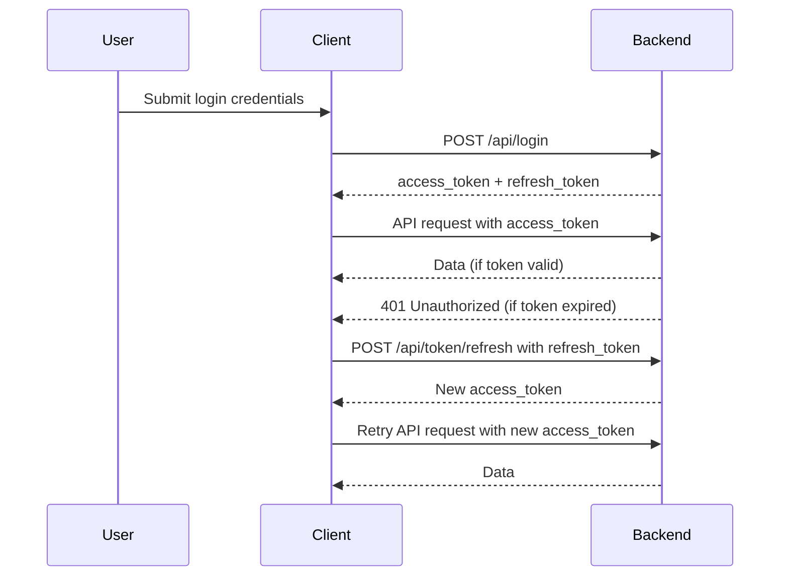

## User Authentication Flow

- **Login:**  
  User submits credentials. Backend returns an `access_token` (short-lived) and a `refresh_token` (long-lived).

- **Access:**  
  Client uses the `access_token` in API requests (`Authorization: Bearer ...`).  
  If the token is valid, access is granted.

- **Expiration:**  
  When the `access_token` expires (e.g., after 60 minutes), API returns 401 Unauthorized.

- **Refresh:**  
  Client sends the `refresh_token` to `/api/token/refresh`.  
  If valid, backend issues a new `access_token`.

- **Repeat:**  
  The cycle continues until the `refresh_token` expires (e.g., after 7 days) or is revoked (e.g., logout).

---

## Token Lifetimes

- **Access Token:** ~60 minutes (configurable)
- **Refresh Token:** ~7 days (configurable)

---

## Mermaid Diagram



# Client side auth implementation

```ts
// On login
const res = await fetch("/api/login", { method: "POST", body: credentials });
const { access_token, refresh_token } = await res.json();
localStorage.setItem("access_token", access_token);
localStorage.setItem("refresh_token", refresh_token);

// On API request failure due to expired access token
async function refreshAccessToken() {
  const refreshToken = localStorage.getItem("refresh_token");
  const res = await fetch("/api/token/refresh", {
    method: "POST",
    headers: { "Content-Type": "application/json" },
    body: JSON.stringify({ refresh_token: refreshToken }),
  });
  const { access_token } = await res.json();
  localStorage.setItem("access_token", access_token);
  return access_token;
}
```

# Check for token expired on api fetch

```ts
// ...existing code...
async function apiRequest(url, options = {}) {
  const accessToken = localStorage.getItem("access_token");
  const headers = {
    ...options.headers,
    Authorization: `Bearer ${accessToken}`,
  };
  const res = await fetch(url, { ...options, headers });

  if (res.status === 401) {
    // Access token expired, try to refresh
    const newToken = await refreshAccessToken();
    // Retry original request with new token
    const retryHeaders = {
      ...options.headers,
      Authorization: `Bearer ${newToken}`,
    };
    const retryRes = await fetch(url, { ...options, headers: retryHeaders });
    return retryRes;
  }

  return res;
}
// ...existing code...
```
