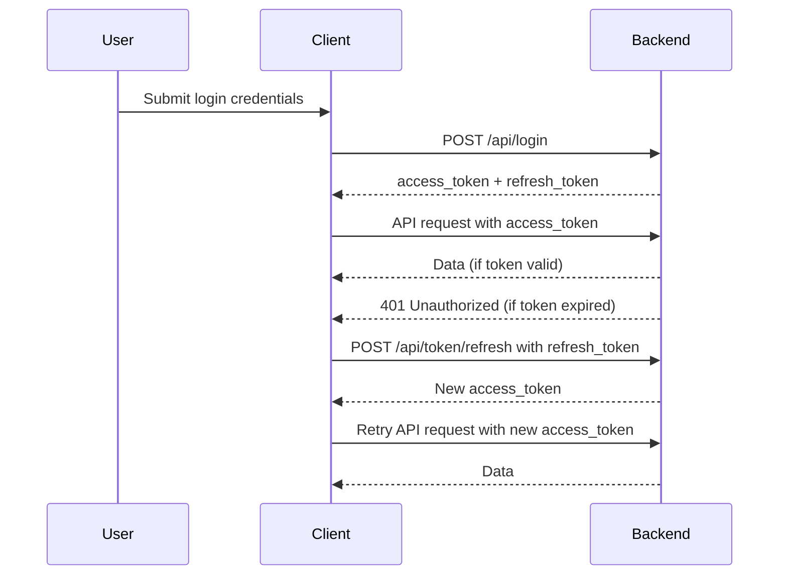

# Doko

Doko is a Progressive Web Application designed to help reunite lost pets with their owners.

## App UI

Doko is a responsive app with two UI templates to choose from: one pastel pink-based color palette and another pastel green-based color palette. The design is mobile-first, as it is a PWA intended primarily for use on mobile devices.

## Monorepo Structure

Doko is organized as a monorepo using pnpm workspaces:

- `apps/backend`: FastAPI backend (Python)
- `apps/frontend`: SvelteKit frontend (TypeScript)
- `packages/`: (optional) Shared libraries or modules

Workspace configuration: see `pnpm-workspace.yaml`

## Technologies

- **Backend:** Python 3, FastAPI, SQLite (scalable to MySQL/PostgreSQL)
- **Frontend:** SvelteKit 5, Prisma ORM, Tailwind CSS, Paraglide i18n

## Backend Setup & Start Guide

### Prerequisites

- Python 3.8+
- (Recommended) Virtual environment tool: `venv` or `virtualenv`

### Installation

1. Navigate to the backend app directory:
   ```bash
   cd apps/backend
   ```
2. Create and activate a virtual environment (optional but recommended):
   ```bash
   python3 -m venv venv
   source venv/bin/activate
   ```
3. Install dependencies:
   ```bash
   pip install -r requirements.txt
   ```

### Running the Backend

Start the FastAPI server using Uvicorn:

```bash
uvicorn main:app --reload
```

- The API will be available at `http://127.0.0.1:8000`
- Health check endpoint: `GET /_health`

## Project Structure

- `apps/backend/main.py`: FastAPI application entry point
- `apps/backend/routers/`: API route modules (users, pets, qrcode, banners, pet_location)
- `apps/backend/models.py`: Database models
- `apps/backend/database.py`: Database configuration
- `apps/frontend/`: SvelteKit frontend app

## User Authentication Flow

- **Login:** User submits credentials. Backend returns an `access_token` (short-lived) and a `refresh_token` (long-lived).
- **Access:** Client uses the `access_token` in API requests (`Authorization: Bearer ...`). If the token is valid, access is granted.
- **Expiration:** When the `access_token` expires (e.g., after 60 minutes), API returns 401 Unauthorized.
- **Refresh:** Client sends the `refresh_token` to `/api/token/refresh`. If valid, backend issues a new `access_token`.
- **Repeat:** The cycle continues until the `refresh_token` expires (e.g., after 7 days) or is revoked (e.g., logout).

### Token Lifetimes

- **Access Token:** ~60 minutes (configurable)
- **Refresh Token:** ~7 days (configurable)

### Authentication Sequence



## Frontend Setup & Start Guide

### Technologies

- **Framework:** SvelteKit 5
- **Styling:** Tailwind CSS
- **ORM:** Prisma (for data modeling)
- **i18n:** Paraglide

### Installation

1. Navigate to the frontend app directory:
   ```bash
   cd apps/frontend
   ```
2. Install dependencies:
   ```bash
   pnpm install
   # or
   npm install
   # or
   yarn install
   ```

### Running the Frontend

Start the SvelteKit dev server:

```bash
pnpm run dev
# or
npm run dev
# or
yarn dev
```

- The app will be available at `http://localhost:5173` (default)

### Building & Preview

To build for production:

```bash
pnpm run build
```

To preview the production build:

```bash
pnpm run preview
```

### Project Structure

- `apps/frontend/src/routes/`: Main SvelteKit routes
- `apps/frontend/src/lib/paraglide/messages/`: i18n message files (auto-generated JS exports)
- `apps/frontend/app.css`: Tailwind CSS entry
- `apps/frontend/package.json`: Project dependencies and scripts

### Developer Workflows

- Unit tests: `pnpm run test:unit` (Vitest)
- E2E tests: `pnpm run test:e2e` (Playwright)
- Lint/format: `pnpm run lint`, `pnpm run format`

### i18n (Paraglide)

- Messages are imported as named exports and called as functions (e.g., `m.button_cancel()`).
- Locale switching: `setLocale('en')`, etc. Messages update reactively if used via Svelte stores.

## Additional Notes

- The backend uses SQLite by default. For production, consider switching to MySQL or PostgreSQL.
- API documentation is available at `/docs` when the server is running.

## Monorepo Commands

- Install all dependencies for all apps/packages:
  ```bash
  pnpm install
  ```
- Run backend:
  ```bash
  cd apps/backend
  uvicorn main:app --reload
  ```
- Run frontend:
  ```bash
  cd apps/frontend
  pnpm run dev
  ```

## Contributing

Pull requests and suggestions are welcome!

## License

Specify your license here.
