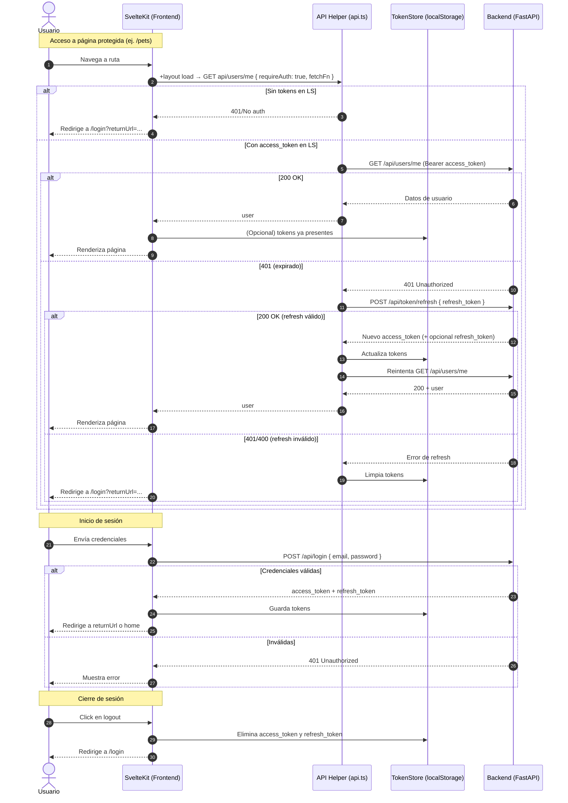

# Petto

Petto is a Progressive Web Application designed to help reunite lost pets with their owners.

## Features

- **Login, Logout, Register and Password recovery**
- **Create a Collection of Pets**
  - Add, Edit, Read, Remove a Pet
  - Generate Pet QR Code in square or circle canvas to print and glue in the pet medal
- **Generate Pet Flyers and A4 Posters**
  - The user could create print ready flyers of lost pet. It must include pet picture, description, indications and pet QR code.

## Monorepo Structure

Petto is organized as a monorepo using pnpm workspaces:

- `backend/`: FastAPI backend (Python)
- `apps/frontend/`: SvelteKit frontend (TypeScript)
- `packages/`: (optional) Shared libraries or modules (e.g., `packages/shared/`)

Workspace configuration: see `pnpm-workspace.yaml`

## Technologies

- **Backend:** Python 3, FastAPI, SQLite (scalable to MySQL/PostgreSQL)
- **Frontend:** SvelteKit 5, Prisma ORM, Tailwind CSS, Paraglide i18n

## Backend Setup & Start Guide

### Prerequisites

- Python 3.8+
- (Recommended) Virtual environment tool: `venv` or `virtualenv`

### Installation

1. Navigate to the backend app directory:
   ```bash
   cd backend
   ```
2. Create and activate a virtual environment (optional but recommended):
   ```bash
   python3 -m venv venv
   source venv/bin/activate
   ```
3. Install dependencies:
   ```bash
   pip install -r requirements.txt
   ```

### Running the Backend

Start the FastAPI server using Uvicorn:

```bash
uvicorn main:app --reload
```

- The API will be available at `http://127.0.0.1:8000`
- Health check endpoint: `GET /_health`

## Project Structure

- `backend/main.py`: FastAPI application entry point
- `backend/routers/`: API route modules (users, pets, qrcode, banners, pet_location)
- `backend/models.py`: Database models
- `backend/database.py`: Database configuration
- `apps/frontend/`: SvelteKit frontend app

## Autenticación y autorización (end-to-end)

Este proyecto implementa autenticación basada en JWT con tokens de acceso (corto plazo) y tokens de refresco (largo plazo), más autorización en rutas del frontend. El flujo cubre inicio de sesión, acceso a páginas protegidas, refresco automático del token y cierre de sesión.

- Backend (FastAPI):
   - `POST /api/login`: emite `access_token` y `refresh_token`.
   - `GET /api/users/me`: devuelve el usuario autenticado (requiere `Authorization: Bearer <access_token>`).
   - `POST /api/token/refresh`: intercambia un `refresh_token` válido por un nuevo `access_token` (y opcionalmente nuevo `refresh_token`).

- Frontend (SvelteKit 5):
   - Helper centralizado `src/lib/utils/api.ts`: añade `Authorization` cuando `requireAuth: true`, usa el `fetch` de `load` si se le pasa, y refresca automáticamente al recibir 401.
   - Layout `routes/+layout.ts`: durante `load`, consulta `api/users/me` mediante el helper; si no hay sesión/tokens válidos, las páginas protegidas redirigen a `/login` con `returnUrl`.
   - Guardia SSR opcional `src/lib/utils/protect-route.ts`: para +page.ts protegidas, valida la sesión del layout y redirige si no existe.
   - Guardia de cliente `src/lib/components/ProtectedRoute.svelte`: asegura que el usuario esté autenticado al renderizar contenido protegido en el cliente.
   - Almacén de sesión `src/lib/stores/session.ts`: guarda el usuario actual; los tokens se almacenan en `localStorage`.

### Secuencia completa (Mermaid)



### Detalles y mejores prácticas

- En `api.ts`, usa siempre `fetchFn` del `load` de SvelteKit cuando esté disponible para evitar warnings y mantener SSR consistente.
- Todas las llamadas autenticadas deberían pasar por el helper (`requireAuth: true`) para beneficiarse del refresco automático.
- Las páginas protegidas pueden combinar: comprobación en `+layout.ts` (hidrata la sesión), `protect-route.ts` para SSR y `ProtectedRoute.svelte` en cliente.
- En fallo de refresh, se limpian tokens y se redirige a `/login?returnUrl=...`.
- Los mensajes de UI e i18n se gestionan con Paraglide; el almacén de sesión mantiene el usuario actual.

## Frontend Setup & Start Guide

### Technologies

- **Framework:** SvelteKit 5
- **Styling:** Tailwind CSS
- **ORM:** Prisma (for data modeling)
- **i18n:** Paraglide

### Installation

1. Navigate to the frontend app directory:
   ```bash
   cd apps/frontend
   ```
2. Install dependencies:
   ```bash
   pnpm install
   # or
   npm install
   # or
   yarn install
   ```

### Running the Frontend

Start the SvelteKit dev server:

```bash
pnpm run dev
# or
npm run dev
# or
yarn dev
```

- The app will be available at `http://localhost:5173` (default)

### Building & Preview

To build for production:

```bash
pnpm run build
```

To preview the production build:

```bash
pnpm run preview
```

### Project Structure

- `apps/frontend/src/routes/`: Main SvelteKit routes
- `apps/frontend/src/lib/paraglide/messages/`: i18n message files (auto-generated JS exports)
- `apps/frontend/app.css`: Tailwind CSS entry
- `apps/frontend/package.json`: Project dependencies and scripts

### Developer Workflows

- Unit tests: `pnpm run test:unit` (Vitest)
- E2E tests: `pnpm run test:e2e` (Playwright)
- Lint/format: `pnpm run lint`, `pnpm run format`

### i18n (Paraglide)

- Messages are imported as named exports and called as functions (e.g., `m.button_cancel()`).
- Locale switching: `setLocale('en')`, etc. Messages update reactively if used via Svelte stores.

## Additional Notes

- The backend uses SQLite by default. For production, consider switching to MySQL or PostgreSQL.
- API documentation is available at `/docs` when the server is running.

## Monorepo Commands

- Install all dependencies for all apps/packages:
  ```bash
  pnpm install
  ```
- Run backend:
  ```bash
   cd backend
  uvicorn main:app --reload
  ```
- Run frontend:
  ```bash
  cd apps/frontend
  pnpm run dev
  ```

## Contributing

Pull requests and suggestions are welcome!

## License

Specify your license here.
