# Petto 🐾

**Petto** is a Progressive Web Application (PWA) designed to help reunite lost pets with their owners. It provides a comprehensive platform for pet management, QR code generation, and location tracking to ensure the safety and quick recovery of your beloved companions.

## ✨ Features

### 👤 User Authentication
- **Login, Logout, Register** - Secure user account management
- **Password Recovery** - Easy password reset functionality
- **JWT-based Authentication** - Access tokens (short-lived) and refresh tokens (long-lived)
- **OAuth2 Support** - Third-party authentication options

### 🐕 Pet Management
- **Create a Collection of Pets** - Manage all your pets in one place
- **CRUD Operations** - Add, Edit, Read, and Remove pets
- **Multi-Image Upload** - Upload up to 5 images per pet (first image is the cover)
- **Image Reordering** - Reorder images before submission
- **Pet Status Tracking** - Track pet status: `at_home`, `lost`, or `found`
- **Pet Types** - Support for Cat, Dog, Lizard, Hamster, Bird, and Other

### 📱 QR Code Generation
- **Generate Pet QR Codes** - Create unique QR codes for each pet
- **Multiple Formats** - Square or circle canvas options
- **Print-Ready** - Perfect for pet medals and tags
- **Scannable Links** - Generate shareable QR links for pet profiles

### 📄 Lost Pet Materials
- **Generate Pet Flyers** - Create print-ready flyers for lost pets
- **A4 Posters** - Generate full-size posters with pet information
- **Custom Content** - Include pet picture, description, contact info, and QR code

### 📍 Location Tracking
- **QR Scan Recording** - Track when and where pet QR codes are scanned
- **Scan History** - View all scans for each pet
- **Location Data** - Help locate lost pets through scan information

## 🏗️ Architecture

Petto is organized as a **monorepo** using pnpm workspaces:

```
petto/
├── backend/          # FastAPI backend (Python)
├── apps/
│   └── frontend/     # SvelteKit frontend (TypeScript)
└── packages/         # (Optional) Shared libraries
```

Workspace configuration: see `pnpm-workspace.yaml`

## 🛠️ Technology Stack

### Backend
- **Runtime:** Python 3.8+
- **Framework:** FastAPI
- **Database:** SQLite (development) - scalable to MySQL/PostgreSQL
- **Authentication:** JWT tokens with refresh mechanism
- **API Documentation:** Auto-generated with Swagger/OpenAPI
- **Image Upload:** Multi-format support (JPEG, PNG, WebP, GIF) - max 5MB

### Frontend
- **Framework:** SvelteKit 5
- **Language:** TypeScript
- **Styling:** Tailwind CSS
- **ORM:** Prisma
- **i18n:** Paraglide (multi-language support)
- **State Management:** Svelte stores
- **Testing:** Vitest (unit) + Playwright (E2E)

## 🚀 Quick Start

### Prerequisites
- **Python 3.8+** (for backend)
- **Node.js 16+** (for frontend)
- **pnpm** (recommended) or npm/yarn

### Backend Setup

1. Navigate to the backend directory:
   ```bash
   cd backend
   ```

2. Create and activate a virtual environment:
   ```bash
   python3 -m venv venv
   source venv/bin/activate  # On Windows: venv\Scripts\activate
   ```

3. Install dependencies:
   ```bash
   pip install -r requirements.txt
   ```

4. Start the FastAPI server:
   ```bash
   uvicorn main:app --reload
   ```

   - API available at: `http://127.0.0.1:8000`
   - API docs: `http://127.0.0.1:8000/docs`
   - Health check: `GET /_health`

### Frontend Setup

1. Navigate to the frontend directory:
   ```bash
   cd apps/frontend
   ```

2. Install dependencies:
   ```bash
   pnpm install
   # or npm install / yarn install
   ```

3. Start the development server:
   ```bash
   pnpm run dev
   ```

   - App available at: `http://localhost:5173`

### Monorepo Commands

From the root directory:

```bash
# Install all dependencies
pnpm install

# Run backend
cd backend && uvicorn main:app --reload

# Run frontend (in another terminal)
cd apps/frontend && pnpm run dev
```

## 📁 Project Structure

### Backend Structure
```
backend/
├── main.py           # FastAPI application entry point
├── routers/          # API route modules
│   ├── users.py
│   ├── pets.py
│   ├── qrcode.py
│   ├── banners.py
│   └── pet_location.py
├── models.py         # Database models
├── database.py       # Database configuration
└── requirements.txt  # Python dependencies
```

### Frontend Structure
```
apps/frontend/
├── src/
│   ├── routes/                      # SvelteKit routes
│   ├── lib/
│   │   ├── components/              # Reusable components
│   │   ├── stores/                  # Svelte stores (session, etc.)
│   │   ├── utils/                   # Helper functions (api.ts, pet.ts)
│   │   └── paraglide/messages/      # i18n message files
│   └── app.css                      # Tailwind CSS entry
├── package.json
└── svelte.config.js
```

## 🔐 Authentication & Authorization

This project implements JWT-based authentication with access tokens (short-lived) and refresh tokens (long-lived), plus route protection in the frontend.

### Backend (FastAPI)
- `POST /api/login` - Issues `access_token` and `refresh_token`
- `GET /api/users/me` - Returns authenticated user (requires `Authorization: Bearer <access_token>`)
- `POST /api/token/refresh` - Exchanges valid `refresh_token` for new `access_token`

### Frontend (SvelteKit 5)
- **API Helper** (`src/lib/utils/api.ts`) - Adds `Authorization` header when `requireAuth: true`, automatically refreshes on 401
- **Layout** (`routes/+layout.ts`) - Queries `api/users/me` during load; protected pages redirect to `/login` with `returnUrl`
- **SSR Guard** (`src/lib/utils/protect-route.ts`) - Validates session in `+page.ts` and redirects if missing
- **Client Guard** (`src/lib/components/ProtectedRoute.svelte`) - Ensures user authentication when rendering protected content
- **Session Store** (`src/lib/stores/session.ts`) - Stores current user; tokens stored in `localStorage`

### Authentication Flow (Mermaid)

```mermaid
sequenceDiagram
   autonumber
   actor U as Usuario
   participant FE as SvelteKit (Frontend)
   participant AH as API Helper (api.ts)
   participant LS as TokenStore (localStorage)
   participant BE as Backend (FastAPI)

   Note over U,FE: Acceso a página protegida (ej. /pets)
   U->>FE: Navega a ruta
   FE->>AH: +layout load → GET api/users/me { requireAuth: true, fetchFn }
   alt Sin tokens en LS
      AH-->>FE: 401/No auth
      FE-->>U: Redirige a /login?returnUrl=...
   else Con access_token en LS
      AH->>BE: GET /api/users/me (Bearer access_token)
      alt 200 OK
         BE-->>AH: Datos de usuario
         AH-->>FE: user
         FE->>LS: (Opcional) tokens ya presentes
         FE-->>U: Renderiza página
      else 401 (expirado)
         BE-->>AH: 401 Unauthorized
         AH->>BE: POST /api/token/refresh { refresh_token }
         alt 200 OK (refresh válido)
            BE-->>AH: Nuevo access_token (+ opcional refresh_token)
            AH->>LS: Actualiza tokens
            AH->>BE: Reintenta GET /api/users/me
            BE-->>AH: 200 + user
            AH-->>FE: user
            FE-->>U: Renderiza página
         else 401/400 (refresh inválido)
            BE-->>AH: Error de refresh
            AH->>LS: Limpia tokens
            FE-->>U: Redirige a /login?returnUrl=...
         end
      end
   end

   Note over U,FE: Inicio de sesión
   U->>FE: Envía credenciales
   FE->>BE: POST /api/login { email, password }
   alt Credenciales válidas
      BE-->>FE: access_token + refresh_token
      FE->>LS: Guarda tokens
      FE-->>U: Redirige a returnUrl o home
   else Inválidas
      BE-->>FE: 401 Unauthorized
      FE-->>U: Muestra error
   end

   Note over U,FE: Cierre de sesión
   U->>FE: Click en logout
   FE->>LS: Elimina access_token y refresh_token
   FE-->>U: Redirige a /login
```



### Best Practices
- Use `fetchFn` from SvelteKit `load` when available for SSR consistency
- All authenticated calls should use the helper (`requireAuth: true`) for automatic token refresh
- Protected pages combine: `+layout.ts` (session hydration), `protect-route.ts` (SSR), and `ProtectedRoute.svelte` (client)
- On refresh failure, tokens are cleared and user is redirected to `/login?returnUrl=...`

## 🗄️ Pet API Data Models

The Pet endpoints use **explicit Pydantic schemas** for clearer versioning, validation control, and security.

### Schema Overview

| Schema | Purpose | Fields |
|--------|---------|--------|
| `PetBase` | Shared core fields | `name`, `pet_type`, `picture`, `notes`, `status` (default `at_home`) |
| `PetCreate` | Creation payload (client → server) | Inherits `PetBase` + `owner_id` (accepted but ignored in favor of authenticated user) |
| `PetUpdate` | Update payload (partial) | All fields optional (`name`, `pet_type`, `picture`, `notes`, `status`, `owner_id`) |
| `PetOut` | Response model | `id`, `owner_id`, plus all `PetBase` fields + `pictures[]` (ordered list; element 0 is cover) |

**Security Rule:** The backend **always overrides** `owner_id` with the authenticated user on create/update.

### Multi-Image Model Mapping

Database maintains legacy `picture` plus optional `picture2`..`picture5` columns for a maximum of 5 images.

API serializes these as:
```javascript
PetOut.pictures = [picture, picture2, picture3, picture4, picture5].filter(Boolean)
```

Frontend uses `getPetCover(pet)` helper from `src/lib/utils/pet.ts` for consistent cover image handling.

### Enum Values
```typescript
PetType   = Cat | Dog | Lizard | Hamster | Bird | Other
PetStatus = at_home | lost | found
```

### Migration Note

Previously used `pydantic_model_creator(Pet, ...)` for auto-generation. Replaced with explicit classes to:
- Enforce ownership rules explicitly
- Support partial updates cleanly
- Avoid accidental field exposure
- Provide stable documentation for external consumers

## 🧪 Development Workflows

### Frontend Testing
```bash
# Unit tests (Vitest)
pnpm run test:unit

# E2E tests (Playwright)
pnpm run test:e2e

# Linting
pnpm run lint

# Formatting
pnpm run format
```

### Building for Production

**Frontend:**
```bash
cd apps/frontend
pnpm run build
pnpm run preview  # Preview production build
```

**Backend:**
- Configure production database (MySQL/PostgreSQL recommended)
- Set environment variables for security
- Use a production ASGI server (e.g., Gunicorn with Uvicorn workers)

## 🌐 i18n (Paraglide)

- Messages are imported as named exports and called as functions: `m.button_cancel()`
- Locale switching: `setLocale('en')` - messages update reactively
- Message files: `apps/frontend/src/lib/paraglide/messages/`

## 📝 API Endpoints

### Pets
- `POST /pets/` - Create a pet
- `GET /pets/` - List pets
- `GET /pets/{pet_id}` - Get pet by ID
- `PUT /pets/{pet_id}` - Update pet
- `DELETE /pets/{pet_id}` - Delete pet

### Users
- `POST /register` - Register user
- `POST /login` - Login
- `GET /users/me` - Get current user
- `POST /password-recovery` - Request password recovery
- `POST /password-reset` - Reset password

### QR Code
- `GET /qrcode/{pet_id}` - Get QR code for pet
- `POST /qrcode/scan/{scan_id}` - Scan QR code

### Pet Location
- `POST /scan` - Record scan
- `GET /pet/{pet_id}/qr-link` - Get QR link for pet
- `GET /pet/{pet_id}/scans` - Get scans for pet

### Banners
- `GET /banners/{pet_id}` - Get banners for pet

### Upload
- `POST /upload` - Authenticated image upload (JPEG/PNG/WebP/GIF, max 5MB)

Full API documentation available at `/docs` when server is running.

## 🤝 Contributing

Pull requests and suggestions are welcome! Please feel free to:
- Report bugs
- Suggest new features
- Improve documentation
- Submit code improvements

## 📄 License

MIT License

Copyright (c) 2026 Pablushka

Permission is hereby granted, free of charge, to any person obtaining a copy
of this software and associated documentation files (the "Software"), to deal
in the Software without restriction, including without limitation the rights
to use, copy, modify, merge, publish, distribute, sublicense, and/or sell
copies of the Software, and to permit persons to whom the Software is
furnished to do so, subject to the following conditions:

The above copyright notice and this permission notice shall be included in all
copies or substantial portions of the Software.

THE SOFTWARE IS PROVIDED "AS IS", WITHOUT WARRANTY OF ANY KIND, EXPRESS OR
IMPLIED, INCLUDING BUT NOT LIMITED TO THE WARRANTIES OF MERCHANTABILITY,
FITNESS FOR A PARTICULAR PURPOSE AND NONINFRINGEMENT. IN NO EVENT SHALL THE
AUTHORS OR COPYRIGHT HOLDERS BE LIABLE FOR ANY CLAIM, DAMAGES OR OTHER
LIABILITY, WHETHER IN AN ACTION OF CONTRACT, TORT OR OTHERWISE, ARISING FROM,
OUT OF OR IN CONNECTION WITH THE SOFTWARE OR THE USE OR OTHER DEALINGS IN THE
SOFTWARE.
